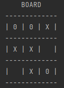

# 
Tic—Tac-Toe

What did people do in boring lessons before the era of mobile phones with the Internet, a bunch of apps and other time eaters? Yes, a lot of things, in general. However, one of these entertainments you know for sure is ["Tic—Tac-Toe"](https://ru.wikipedia.org/wiki/Крестики-нолики)!

Do you understand what the course of our thoughts is going to? We will try to create our first computer game!

We don't know how to create a GUI graphical shell yet, but it's not scary, because we use the console. It will turn out to be a kind of cybervintage.

So we have:

1. The game ["Tic-Tac-Toe"](https://ru.wikipedia.org/wiki/Крестики-нолики).
2. The console where the game progress will be displayed. We will do this using formatted strings.
3. An insatiable desire to write something real with your own hands.

The field size is assumed to be 3x3.

Example of printing a field to the console:

# 
