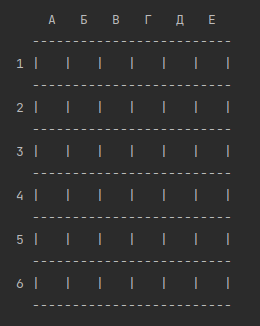
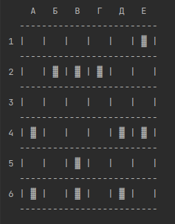
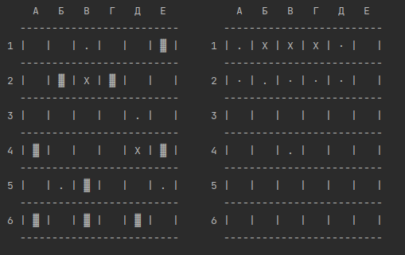

# 
Игра «Морской бой».
### С правилами и разновидностями игры можно ознакомится по [ссылке](https://ru.wikipedia.org/wiki/Морской_бой_(игра)).
### Интерфейс приложения представляет собой консольное окно с двумя полями 6х6 вида:

### Игрок играет с компьютером. Компьютер "стреляет" наугад, но по тем клеткам, в которые он ещё не "стрелял".
### Корабли на доске отображаються следующим образом (пример):
   

### В начале игры На каждой доске (у компьютера и у игрока) находится следующее количество кораблей: 
* 1 корабль на 3 клетки;
* 2 корабля на 2 клетки;
* 4 корабля на одну клетку.

### Буквой "X" помечаются подбитые корабли, точкой "." — промахи и область вокруг кораблей.
### Например:

### Побеждает тот, кто быстрее всех разгромит корабли противника.
## *Хватит нудных рассуждений, пора узнать на чьей стороне удача!*